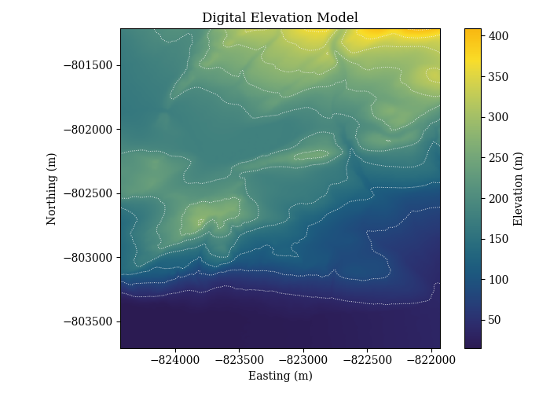
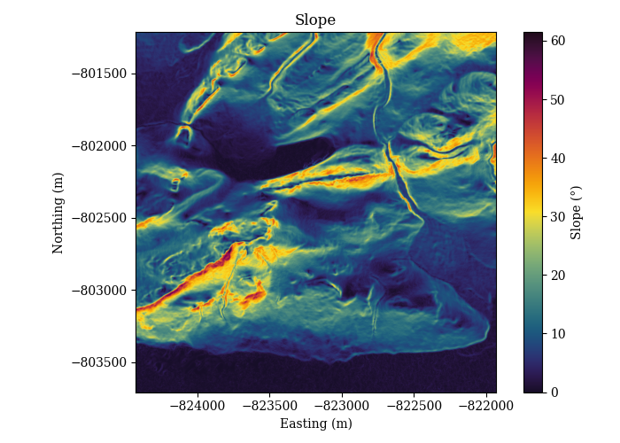
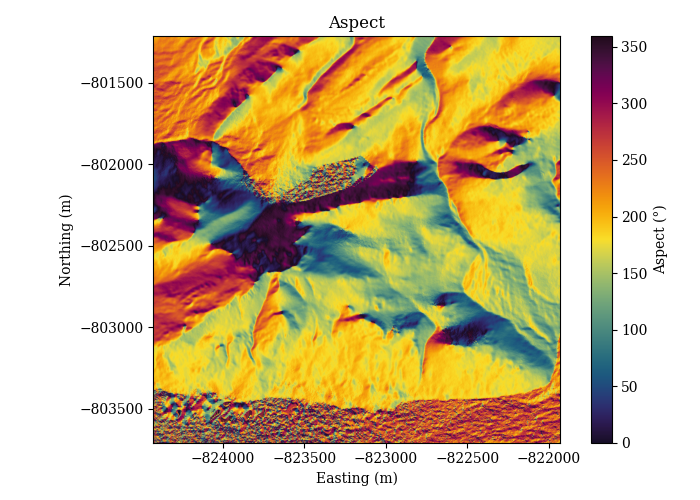
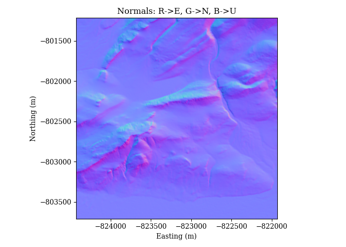
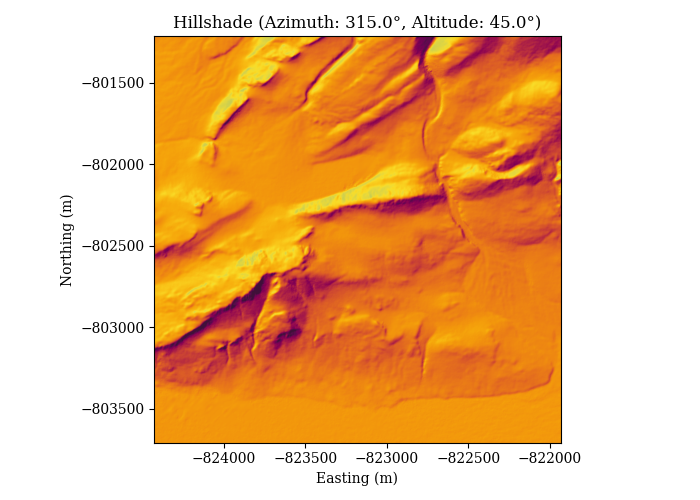
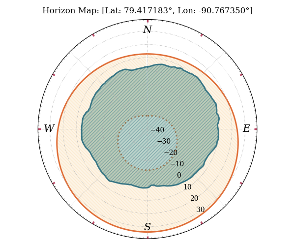
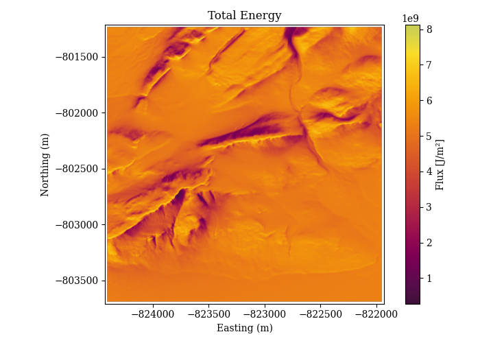
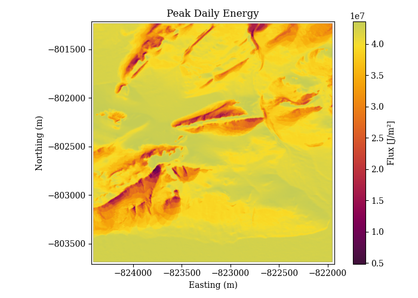
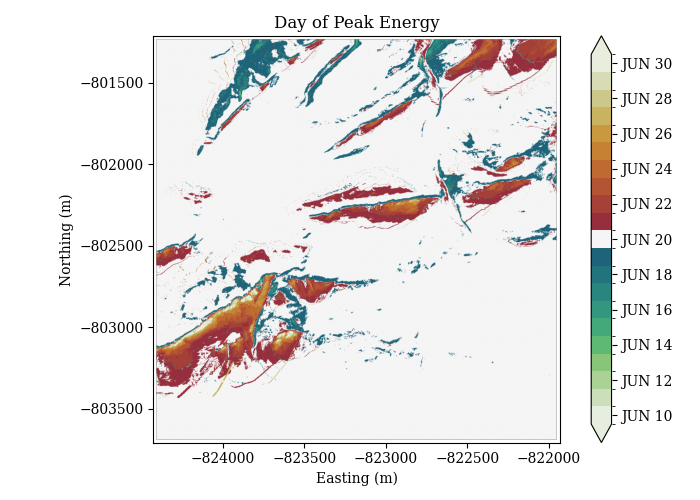

# Command Line Tools

Solshade provides a suite of command-line tools to compute terrain parameters, model solar illumination, and visualize results.  
Below is a guide to each tool with commands and example plots. For any of these tools to work, you need a **Digital Elevation Model (DEM)** `geoTIFF` file. For exploration you can either use the test data available on the `solshade` github repo.

```bash
mkdir -p data/tifs
wget -O data/tifs/MARS.tif https://raw.githubusercontent.com/amanchokshi/solshade/main/tests/data/MARS.tif
```

---

## Metadata

The `solshade meta` tool provides a neat metadata summary from a DEM file

```bash
solshade -v meta data/tifs/MARS.tif
```

```
[2025-09-11 15:49:03 DEBUG    ] solshade: Configured logging: level=10, handlers=2, file=None
[2025-09-11 15:49:03 DEBUG    ] solshade.cli: CLI logging configured (level=DEBUG, logfile=None)
[2025-09-11 15:49:03 DEBUG    ] solshade.terrain: Loading DEM from data/tifs/MARS.tif
[2025-09-11 15:49:03 INFO     ] solshade.terrain: Loaded DEM: shape=(1250, 1250), CRS=EPSG:3413, resolution=(2.0, -2.0)

--------------------------------------------------------
  METADATA: [ MARS.tif ]
--------------------------------------------------------

  CRS:         [ EPSG:3413 ]
  SHAPE:       [ 1250, 1250 ]
  RESOLUTION:  [ 2.0 x 2.0 ]
  TRANSFORM:   |        2.00,        0.00,  -824430.00 |
               |        0.00,       -2.00,  -801210.00 |
               |        0.00,        0.00,        1.00 |
  BOUNDS:      [ -824430.0, -803710.0, -821930.0, -801210.0 ]
  LATITUDE:    [ 79.400563 to 79.432932 ]
  LONGITUDE:   [ -90.729117 to -90.731363 ]
  COORDS:      [ BAND, X, Y, SPATIAL_REF ]
  DTYPE:       [ FLOAT32 ]
  ATTRIBUTES:
        AREA_OR_POINT: Area
        SCALE_FACTOR: 1.0
        ADD_OFFSET: 0.0
```

## Compute

The `solshade compute` tool provides the option for various computational stages of DEM and solar data analysis

### 1. Compute Slope

**Description**:  
Computes the slope (gradient) at each pixel of the DEM in degrees.

**Command**:
```bash
solshade -v compute slope --output-dir ./data/tifs ./data/tifs/MARS.tif
```

---

### 2. Compute Aspect

**Description**:  
Computes the aspect (orientation of slope) at each pixel of the DEM in degrees from North.

**Command**:
```bash
solshade -v compute aspect --output-dir ./data/tifs ./data/tifs/MARS.tif
```

---

### 3. Compute Surface Normals

**Description**:  
Generates 3D ENU (East-North-Up) surface normal vectors for each DEM pixel.

**Command**:
```bash
solshade -v compute normals --output-dir ./data/tifs ./data/tifs/MARS.tif
```

---

### 4. Compute Hillshade

**Description**:  
Simulates shading based on a virtual sun at given azimuth and altitude angles.

**Command**:
```bash
solshade -v compute hillshade --output-dir ./data/tifs --azimuth 315 --altitude 45 ./data/tifs/MARS.tif
```

---

### 5. Compute Horizon Map

**Description**:  
Calculates per-pixel horizon elevation angles across multiple azimuth directions.

**Command**:
```bash
solshade -v compute horizon --output-dir ./data/tifs --n-directions 360 --max-distance 2000 --step 20 --chunk-size 32 --n-jobs -1 ./data/tifs/MARS.tif
```

---

### 6. Compute Solar Flux Time Series

**Description**:  
Generates solar flux timeseries at each pixel using the DEM and horizon map.

**Command**:
```bash
solshade -v compute fluxseries --output-dir ./data/tifs ./data/tifs/MARS.tif ./data/tifs/MARS_HORIZON_360.tif
```

---

## Plot

The `solshade plot` tool provides options for plotting and exploring various DEM or `solshade compute` data products


### 1. Plot DEM

**Description**:  
Visualizes the DEM with contour overlays.

**Command**:
```bash
solshade -v plot dem --output-dir ./data/plots ./data/tifs/MARS.tif
```

**Example Output**:  


---

### 2. Plot Slope

**Description**:  
Visualizes slope values across the DEM.

**Command**:
```bash
solshade -v plot slope --output-dir ./data/plots ./data/tifs/MARS.tif
```

**Example Output**:  


---

### 3. Plot Aspect

**Description**:  
Visualizes aspect values across the DEM.

**Command**:
```bash
solshade -v plot aspect --output-dir ./data/plots ./data/tifs/MARS.tif
```

**Example Output**:  


---

### 4. Plot Normals

**Description**:  
Visualizes ENU surface normals as RGB maps.

**Command**:
```bash
solshade -v plot normals --output-dir ./data/plots ./data/tifs/MARS.tif
```

**Example Output**:  


---

### 5. Plot Hillshade

**Description**:  
Visualizes shaded terrain under virtual sun angles.

**Command**:
```bash
solshade -v plot hillshade --output-dir ./data/plots ./data/tifs/MARS.tif
```

**Example Output**:  


---

### 6. Plot Horizon

**Description**:  
Plots the horizon profile at a specified location with optional solar overlay.

**Command**:
```bash
solshade -v plot horizon --output-dir ./data/plots --lat 79.417183 --lon -90.767350 ./data/tifs/MARS_HORIZON_360.tif --solar --startutc 2025-01-01T00:00:00Z --stoputc 2026-01-01T00:00:00Z --timestep 3600
```

**Example Output**:  


---

### 7. Plot Total Energy

**Description**:  
Visualizes the total integrated solar energy.

**Command**:
```bash
solshade -v plot total-energy --output-dir ./data/plots ./data/tifs/MARS_TOTAL_ENERGY.tif
```

**Example Output**:  


---

### 8. Plot Peak Energy

**Description**:  
Visualizes the peak solar energy at each pixel.

**Command**:
```bash
solshade -v plot peak-energy --output-dir ./data/plots ./data/tifs/MARS_PEAK_ENERGY.tif
```

**Example Output**:  


---

### 9. Plot Day of Peak

**Description**:  
Visualizes the day when peak solar energy occurs.

**Command**:
```bash
solshade -v plot day-of-peak --output-dir ./data/plots ./data/tifs/MARS_DAY_OF_PEAK.tif
```

**Example Output**:  


---
